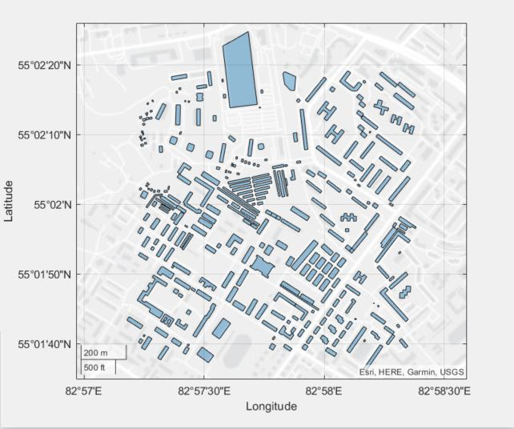
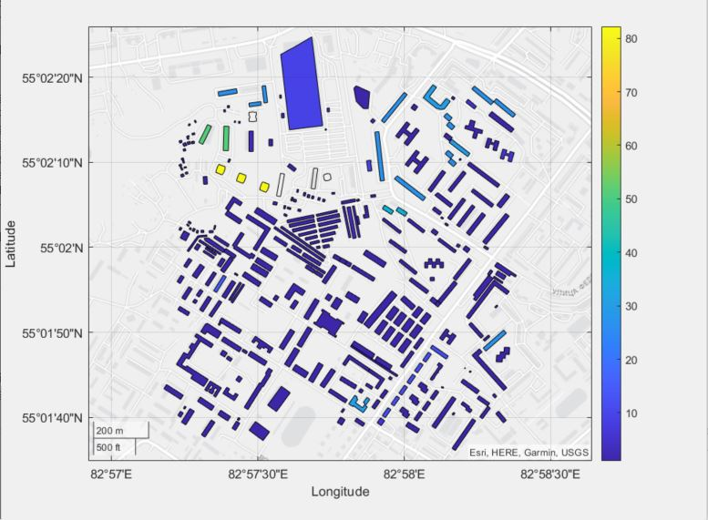

# OSM Tools MATLAB Implementation

This is a MATLAB implementation to read OpenStreetMap (OSM) files and extract building and road data from them as data tables. It consists of several functions that parse the OSM file and create a MATLAB data structure of the file contents.

# Table of content

- [Functions](#functions)
- [Example Usage](#example-usage)
- [License](#license)

## Functions

### osm_to_struct

This function loads an OSM XML data file and returns a MATLAB data structure of the parsed file.
#### Input

    filename: String of the OSM XML Data file name. The file extension could be .osm or .xml.

#### Output

    struc: MATLAB data structure of the parsed OpenStreetMap file.

### get_nodes

This function extracts the nodes data from the struct created by osm_to_struct and returns a MATLAB data table of the nodes in the OpenStreetMap file containing the following columns: id, lat, and lon.
#### Input

    struc: MATLAB data structure of the parsed OpenStreetMap file.

#### Output

    nodes: MATLAB data table of the nodes in the OpenStreetMap file containing the following columns: id, lat, and lon.
    
|     id    | lat | lon  |
| --------- | --------- | --------- |
|  29052337 | 55.033 | 82.973 |

### get_ways

This function extracts the ways data from the struct created by osm_to_struct and returns a MATLAB data table of the ways in the OpenStreetMap file containing the following columns: id, timestamp, node_ids, and tags.
#### Input

    struc: MATLAB data structure of the parsed OpenStreetMap file.

#### Output

    ways: MATLAB data table of the ways in the OpenStreetMap file containing the following columns: id, timestamp, node_ids, and tags.
    
|     id    | timestamp | node_ids  |    tags   |
| --------- | --------- | --------- | --------- |
|  29052337 | 03-May-2013 | struct array | struct array |

### get_bounds

This function extracts the bounding box from the struct created by osm_to_struct and returns a MATLAB polyshape structure that defines the boundary of the map.
#### Input

    struc: MATLAB data structure of the parsed OpenStreetMap file.

#### Output

    bounding_box: MATLAB polyshape structure that defines the boundary of the map.

### clean_ways

This function removes ways that do not have associated tags from the ways data table returned by get_ways.
#### Input

    ways: MATLAB data table of ways from the parsed OpenStreetMap file containing the following columns: id, timestamp, node_ids, and tags.

#### Output

    cleaned_ways: MATLAB data table of the ways in the OpenStreetMap file containing the following columns: id, timestamp, node_ids, and tags.

### classify_ways

This function classifies the ways by adding primary and secondary categories such as building or highway.
#### Input

    ways: MATLAB data table of ways from the parsed OpenStreetMap file containing the following columns: id, timestamp, node_ids, and tags.
    
|     id    | timestamp | node_ids  |    tags   | primary_category | secondary_category |
| --------- | --------- | --------- | --------- | --------- | --------- |
|  29052337 | 03-May-2013 | struct array | struct array | "highway" | "tertiary" |

#### Output

    classified_ways: MATLAB data table of ways from the parsed OpenStreetMap file containing the following columns: id, timestamp, node_ids, tags, primary_category, and secondary_category.

### build_geo_shapes

This function builds the geographical shapes from the ways table based on the primary category.
#### Input

    classified_ways: MATLAB data table of ways from the parsed OpenStreetMap file containing the following columns: id, timestamp, node_ids, tags, primary_category, and secondary_category.
    nodes: MATLAB data table of the nodes in the OpenStreetMap file containing the following columns: id, lat, and lon.

#### Output

    shaped_ways: classified_ways table with an additional column that contains the geo shape.
    
|     id    | timestamp | node_ids  |    tags   | primary_category | secondary_category | shapes |
| --------- | --------- | --------- | --------- | --------- | --------- | --------- |
|  29052337 | 03-May-2013 | struct array | struct array | "building" | "school" | geopolyshape |

### filter_by_category

This function filters the ways table based on the primary category.
#### Input

    classified_ways: MATLAB data table of ways from the parsed OpenStreetMap file containing the following columns: id, timestamp, node_ids, tags, primary_category, and secondary_category.
    category: The category to filter such as building or highway.

#### Output

    category_table: Filtered classified_ways table.

## Examples Usage

Here is a basic example that demonstrates how to plot buildings using the osm_to_struct, get_ways, clean_ways, classify_ways, build_geo_shapes, and filter_by_category functions:


```matlab
% Load OSM file
osm_file = 'example.osm';
struc = osm_to_struct(osm_file);

% Extract ways and filter by building category
ways = get_ways(struc);
ways = clean_ways(ways);
classified_ways = classify_ways(ways);
buildings = filter_by_category(classified_ways, 'building');

% Get nodes and build geo shapes
nodes = get_nodes(struc);
shaped_buildings = build_geo_shapes(buildings, nodes);

% Plot buildings
geoplot(shaped_buildings.shapes);
```



We can change the example above to shows the buildings with different colors based on their heights


```matlab
% Load OSM file
osm_file = 'example.osm';
struc = osm_to_struct(osm_file);

% Extract ways and filter by building category
ways = get_ways(struc);
ways = clean_ways(ways);
classified_ways = classify_ways(ways);
buildings = filter_by_category(classified_ways, 'building');

% Get nodes and build geo shapes
nodes = get_nodes(struc);
shaped_buildings = build_geo_shapes(buildings, nodes);

% Get building heights
heights = zeros(1, height(buildings));
for i = 1:(height(buildings))
    building = buildings(i,:);
    tags = building.tags{1};
    tags_table = struct2table(tags);
    tmp = tags_table(tags_table.kAttribute == 'height', :);
    if height(tmp) == 1
       heights(i) = str2double(tmp.vAttribute{1});
    else
        tmp = tags_table(tags_table.kAttribute == "building:levels", :);
        if height(tmp) == 1
            heights(i) = str2double(tmp.vAttribute{1})*3;
        else
            heights(i) = 1;
        end
    end
end

% Plot buildings with in different colors based on their hieghts
geoplot(shaped_buildings.shapes, ColorData=heights);
colorbar;
```



## License

The code is released under the MIT License.
